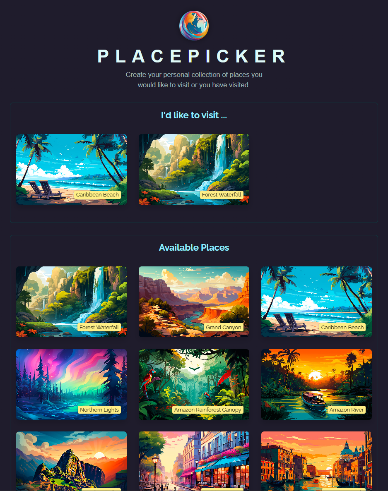

# React Data Fetching - Place Picker

A React app that allows users to manage a collection of places they would like to visit or have visited. The app fetches available places from a server, tracks selected places, and allows users to add or remove them from their collection. It also uses geolocation to sort places by proximity.
This project demonstrates effective use of React hooks such as `useState`, `useEffect`, and `useCallback` for managing state, handling asynchronous data fetching, and optimizing performance.
<br><br>


## 🚀 Getting Started

### **Prerequisites**
Make sure you have the following installed before running the project:
- **Node.js** (Download from [nodejs.org](https://nodejs.org/))
- **npm** or **yarn** (Comes with Node.js)
<br>

### **Installation**
1. Clone this repository:
   ```sh
   git clone https://github.com/nathenpriyonggo/react-data-fetching
   ```
2. Navigate to the directory
   ```sh
   cd react-data-fetching
   ```
3. Install dependencies:
   ```sh
   npm install
   ```
4. Start the development server:
   ```sh
   npm run dev
   ```
5. Open ```http://localhost:5173/``` in your browser.
<br>

## 🛠️ Built With
- **React** - A JavaScript library for building user interfaces
- **Vite** - A fast build tool for modern web projects
- **Express** - A backend framework for handling HTTP requests
- **React Hooks** – For managing state and side effects
<br>

## 🎮 App Features
- **Fetch and Display Places** - Fetch available places from an API and sort them by distance from the user’s current location using geolocation.
- **Add and Remove Places** - Users can add places to their personal collection or remove them.
- **Error Handling** - The app gracefully handles errors such as failed API requests or user location access errors.
- **History Tracking** - Tracks the places the user has selected and displays them with options to remove or update the list.
- **Responsive UI** - The app adjusts its layout based on screen size, making it mobile-friendly.
- **Optimized Performance** - Uses useCallback and useMemo to optimize performance and avoid unnecessary re-renders.
<br>

## 🧩 How It Works
The app consists of several key components:
1. **Backend** - `Express API`
  - The backend provides endpoints to fetch available places `/places` and user-specific places `/user-places`, as well as to update the user's collection of places.
  - Data is stored in local JSON files `/places.json`, `/user-places.json`.
2. **Frontend** - `React`
  - App Component - Manages the state for the user’s selected places and interacts with the backend to fetch and update the places.
  - AvailablePlaces Component - Displays places fetched from the backend and sorted by proximity using geolocation.
  - Places Component - A reusable component to display lists of places with options to select and remove places.
  - Modal Component - Displays modals for confirming actions like deleting a place.
  - Error Handling - The app displays user-friendly error messages when data fetching fails or if there’s an issue with geolocation.
<br>

## 📝 API Endpoints
1. **GET /places**: Fetches a list of available places.
2. **GET /user-places**: Fetches the user's selected places.
3. **PUT /user-places**: Updates the user’s collection of places.
<br>

## 🖥️ Preview
<p align="center"></p>
<br>

## 📜 License
This project is open-source. Feel free to fork, modify, and expand upon it!
<br><br>


---

✨ Happy coding! 🚀
